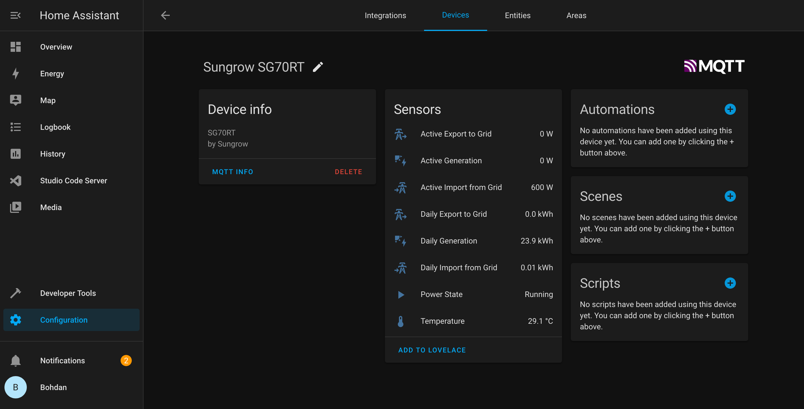
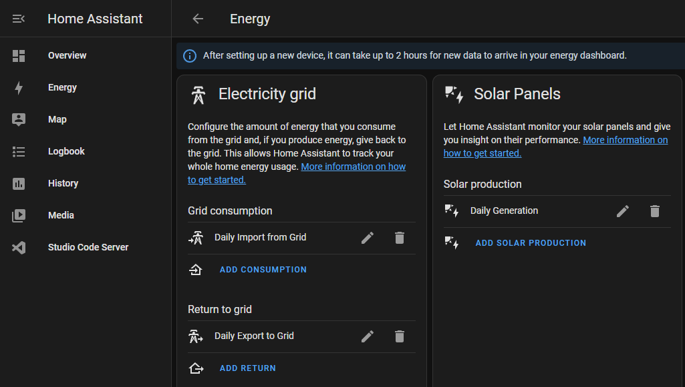

<div id="top"></div>

[![Contributors][contributors-shield]][contributors-url]
[![Forks][forks-shield]][forks-url]
[![Stargazers][stars-shield]][stars-url]
[![Issues][issues-shield]][issues-url]
[![GPL3 License][license-shield]][license-url]

<br />
<div align="center">

<h2 align="center">SunGather</h2>

  <p align="center">
    Collect data from Sungrow Inverters using ModbusTcpClient, <a href="https://github.com/rpvelloso/Sungrow-Modbus">SungrowModbusTcpClient</a> or <a href="https://github.com/bohdan-s/SungrowModbusWebClient">SungrowModbusWebClient</a> and export to various locations.
    <br />
    <br />
    <a href="https://sungather.net">Website Sungather.net</a>
    ·
    <a href="https://github.com/bohdan-s/SunGather/issues">Report Bug</a>
    ·
    <a href="https://github.com/bohdan-s/SunGather/issues">Request Feature</a>
  </p>
</div>

<!-- ABOUT THE PROJECT -->
## About The Project

<b>Join the Discord Server to discuss, suggestions or for any help: <a href="https://discord.gg/7j2MVsT5wn">SunGather Discord</a></b>

<b>If you are looking for the HomeAssistant Addon, see: <a href="https://github.com/bohdan-s/hassio-repository">Hassio Repository</a></b>

Access ModBus data from almost any network connected Sungrow Inverter.

On first connection the tool will query your inverter, retrieve the model and return the correct registers for your device. No more searching registers or creating model files.

Register information based on official documentation: <a href="https://github.com/bohdan-s/Sungrow-Inverter/blob/main/Modbus%20Information/Communication%20Protocol%20of%20PV%20Grid-Connected%20String%20Inverters_V1.1.37_EN.pdf">Communication Protocol of PV Grid-Connected String Inverters</a> and <a href="https://github.com/bohdan-s/Sungrow-Inverter/blob/main/Modbus%20Information/communication-protocol-of-residential-hybrid-inverterv1.0.20-1.pdf">Communication Protocol of Residential Hybrid Inverters</a>

Has multiple export locations out of the box:
* Full Home Assistant Support, as HassIO add-on
* Console - Log directly to screen
* MQTT - Load into MQTT, and optionally Home Assistance including Discovery
* PVOutput - Load into PVOutput.org
* InfluxDB - Load data directly into InfluxDB (v1.8 or v2.x)
* Prometheus - Scrape from /metrics endpoint
* Simple webserver showing collected data
* Rasberry Pi Docker support
* and more coming....

I have learned a lot from the following projects, THANK YOU
* [solariot](https://github.com/meltaxa/solariot)
* [modbus4mqtt](https://github.com/tjhowse/modbus4mqtt)
* [ModbusTCP2MQTT](https://github.com/TenySmart/ModbusTCP2MQTT)

<p align="right">(<a href="#top">back to top</a>)</p>


## Built With

* [Python3](https://www.python.org/)

### Requires
* [paho-mqtt](https://pypi.org/project/paho-mqtt/)
* [pymodbus](https://pypi.org/project/pymodbus/)
* [SungrowModbusTcpClient](https://pypi.org/project/SungrowModbusTcpClient/)
* [SungrowModbusWebClient](https://pypi.org/project/SungrowModbusWebClient/)
* [PyYAML](https://pypi.org/project/PyYAML/)
* [requests](https://pypi.org/project/requests/)
* [influxdb-client](https://pypi.org/project/influxdb-client/)

<p align="right">(<a href="#top">back to top</a>)</p>

<!-- GETTING STARTED -->
## Getting Started
### Local
```sh
git clone https://github.com/bohdan-s/SunGather.git
cd SunGather
pip3 install --upgrade -r requirements.txt
```
Copy config-example.yaml to config.yaml, change values as required (see comments in file)
```sh
cd SunGather
copy config-example.yaml config.yaml
```
Run SunGather:
```sh
python3 sungather.py
```

### Docker
docker run options:  
-v {path to}/config.yaml:/config/config.yaml  <- Set Config File Location  
-v {logpath}:/logs                            <- Set Log folder Location if using log to file (also set log_file in config.yaml)  
-e TZ=Australia/Sydney                        <- Set Timezone  
-p 8080:8080                                  <- Set Web server port (only if using the webserver export)  

```sh
docker pull bohdans/sungather
docker run -d --name sungather \
  --restart always \
  -v {path to}/config.yaml:/config/config.yaml \
  -v {logpath}:/logs \
  -e TZ=Australia/Sydney \
  -p 8080:8080 \
  bohdans/sungather
```
Note: replace Australia/Sydney with relevant timezone
<p align="right">(<a href="#top">back to top</a>)</p>


<!-- USAGE EXAMPLES -->
## Usage

See config-example.yaml it contains default options and comments.

If you want to use the new Energy section in Home Assistant, follow the Home Assistant setup below.
<p align="right">(<a href="#top">back to top</a>)</p>

### Commandline Arguments
usage: python3 sungather.py [options]

Commandline arguments override any config file settings  
**-c config.yaml** - Specify config file.  
**-r registersfile.yaml** - Specify registersfile.
**-v 30** - Logging Level, 10 = Debug, 20 = Info, 30 = Warning (default), 40 = Error  
**--runonce** - Run once then exit  
**-h** - print this help message and exit (also --help)  

Example:  
```sh
python3 sungather.py -c /full/path/config.yaml
```

### Exports

A collection of exports are available:

* console:    Output information to console, useful for troubleshooting
* webserver:  Output to a simple website, default http://localhost:8080 or http://\<serverip\>:8080
* mqtt:       Output to a pre-existing MQTT server, needed for Home Assistant integration
* pvoutput:   Output to PVOutput.org, requires account and solar is set up on website first. 
* InfluxDB:   Output directly to InfluxDB, can then be used by Grafana, etc..

### Registers

This tool should be able to access most registers exposed.
Set the following in config.yaml under inverters section.
* level: 1 - This is the most useful data for day to day
* Level: 2 - This should be everything your inverter supports
* Level: 3 - This will try every register, you will get lots of 0/65535 responses for registers not supported.

* smart_meter: True - (_Only needed for SG* Models_) Set to true if you have a smart meter installed, this will return power usage at the meter box, without it you cannot calculate house power usage. Hybrid inverters will provide this by default (load_power_hybrid)

### Useful Registers:
This is just a brief list of registers I have found useful

**daily_power_yields** - Total Power in kWh generated today  
**total_power_yields** - Total Power in kWh generated since inverter install  
**total_running_time** - Total Hours inverter has been powered on since install  
**internal_temperature** - Internal temperature of the Inverter  
**total_active_power** - Current power being generated by the inverter in Watts  
**meter_power** - (_SG* Models_)Power usage at the meter box, needs a smart meter installed. +ve means consuming from the grid, -ve means exporting to the grid  
**load_power** - Power being consumed in total  
**load_power_hybrid** - (_SH* Models only_) Power being consumed in total  
**export_to_grid** - How much being currently exported to the grid. 
For SG* Models this is calculated from meter_power if -ve value, returned as a positive value. (_For Hybrid models export_power_hybrid is used_)  
**import_from_grid** - How much being currently imported from grid. This is calculated from meter_power if +ve value (_for hybrid models export_power_hybrid [will be negative when importing from grid] is used)   
**timestamp** - Last time data was collected, based on Inverters clock by default  

<p align="right">(<a href="#top">back to top</a>)</p>

### Home Assistant setup

#### The following are manual steps if you are running SunGather separate,
#### For the easy way see: <a href="https://github.com/bohdan-s/hassio-repository">Hassio Repository</a></b>


In the SunGather config.yaml you need to set the smart_meter if you have one  
_For Hybrid Models smart_meter doesn't need to get enabled_

```
# Only for SG* Models
smart_meter: True
```

Enable MQTT, configure the server and HA AutoDiscovery
```
  - name: mqtt
    enabled: True
    host: 192.168.1.200
    homeassistant: True
```
You will get a device automatically configured for your inverter:


To configure the HomeAssistant Energy Dashboard:

Go to : **Settings** > **Dashboards** > **Engergy**
* Electricity Grid > Grid Consumption -> Daily Import from Grid 
* Electricity Grid > Return to Grid -> Daily Export to Grid
* Solar Panels > Solar Production -> Daily Generation 




<p align="right">(<a href="#top">back to top</a>)</p>

## Tested Devices
* SG7.0RT with WiNet-S Dongle
* SG10RT with WiNet-S Dongle and Ethernet (Credit: @rark-ha)
* SH6.0RT with WiNet-S Dongle
* SH10RT(-V112) with WiNet-S Dongle and Ethernet

<p align="right">(<a href="#top">back to top</a>)</p>

## Supported Devices
### PV Grid-Connected String Inverters
SG30KTL, SG10KTL, SG12KTL, SG15KTL, SG20KTL, SG30KU, SG36KTL, SG36KU, SG40KTL, SG40KTL-M, SG50KTL-M, SG60KTL-M, SG60KU, SG30KTL-M, SG30KTL-M-V31, SG33KTL-M, SG36KTL-M, SG33K3J, SG49K5J, SG34KJ, LP_P34KSG, SG50KTL-M-20, SG60KTL, SG80KTL, SG80KTL-20, SG60KU-M, SG5KTL-MT, SG6KTL-MT, SG8KTL-M, SG10KTL-M, SG10KTL-MT, SG12KTL-M, SG15KTL-M, SG17KTL-M, SG20KTL-M, SG80KTL-M, SG111HV, SG125HV, SG125HV-20, SG30CX, SG33CX, SG36CX-US, SG40CX, SG50CX, SG60CX-US, SG110CX, SG250HX, SG250HX-US, SG100CX, SG100CX-JP, SG250HX-IN, SG25CX-SA, SG75CX, SG3.0RT, SG4.0RT, SG5.0RT, SG6.0RT, SG7.0RT, SG8.0RT, SG10RT, SG12RT, SG15RT, SG17RT, SG20RT

### PV Grid-Connected String Inverters Gen 2
SG5K-D, SG8K-D

### Residential Hybrid Inverters
SH5K-20, SH3K6, SH4K6, SH5K-V13, SH5K-30, SH3K6-30, SH4K6-30, SH5.0RS, SH3.6RS, SH4.6RS, SH6.0RS, SH10RT(-V112), SH8.0RT, SH6.0RT, SH5.0RT

<p align="right">(<a href="#top">back to top</a>)</p>


## Building
Multi Arch (BuildX) Including Raspberry Pi
```sh
docker run --privileged --rm tonistiigi/binfmt --install all
docker buildx create --platform linux/amd64,linux/arm64/v8 --use
docker buildx build --push --platform linux/amd64,linux/arm64/v8 -t bohdans/sungather:latest -t bohdans/sungather:v<version> .
```
Current Arch (docker build)
```sh
docker build --no-cache --rm -t bohdans/sungather:latest -t bohdans/sungather:v<version> .
docker push bohdans/sungather -a
```


<p align="right">(<a href="#top">back to top</a>)</p>

<!-- LICENSE -->
## License

Distributed under the GPL3 License. See `LICENSE.txt` for more information.

<p align="right">(<a href="#top">back to top</a>)</p>

<!-- CONTACT -->
## Contact

Project Link: [https://github.com/bohdan-s/SunGather](https://github.com/bohdan-s/SunGather)

<p align="right">(<a href="#top">back to top</a>)</p>

<!-- ACKNOWLEDGMENTS -->
## Acknowledgments

* [solariot](https://github.com/meltaxa/solariot)
* [modbus4mqtt](https://github.com/tjhowse/modbus4mqtt)
* [ModbusTCP2MQTT](https://github.com/TenySmart/ModbusTCP2MQTT)

<p align="right">(<a href="#top">back to top</a>)</p>


<!-- MARKDOWN LINKS & IMAGES -->
<!-- https://www.markdownguide.org/basic-syntax/#reference-style-links -->
[contributors-shield]: https://img.shields.io/github/contributors/bohdan-s/SunGather.svg?style=for-the-badge
[contributors-url]: https://github.com/bohdan-s/SunGather/graphs/contributors
[forks-shield]: https://img.shields.io/github/forks/bohdan-s/SunGather.svg?style=for-the-badge
[forks-url]: https://github.com/bohdan-s/SunGather/network/members
[stars-shield]: https://img.shields.io/github/stars/bohdan-s/SunGather.svg?style=for-the-badge
[stars-url]: https://github.com/bohdan-s/SunGather/stargazers
[issues-shield]: https://img.shields.io/github/issues/bohdan-s/SunGather.svg?style=for-the-badge
[issues-url]: https://github.com/bohdan-s/SunGather/issues
[license-shield]: https://img.shields.io/github/license/bohdan-s/SunGather.svg?style=for-the-badge
[license-url]: https://github.com/bohdan-s/SunGather/blob/main/LICENSE.txt
